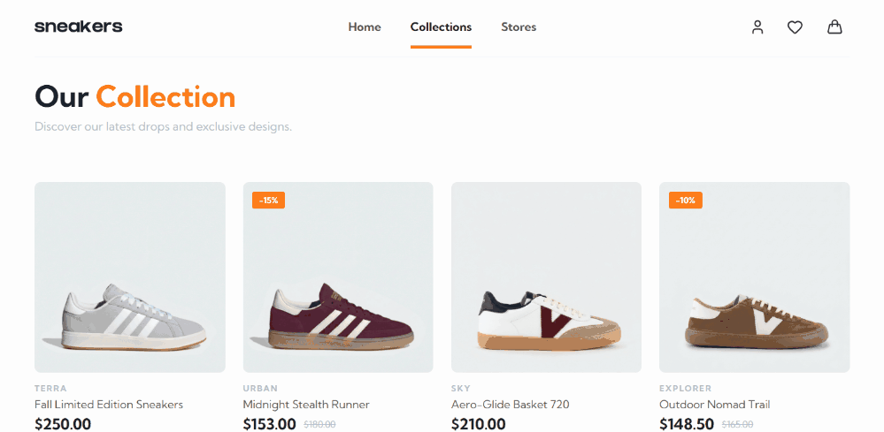
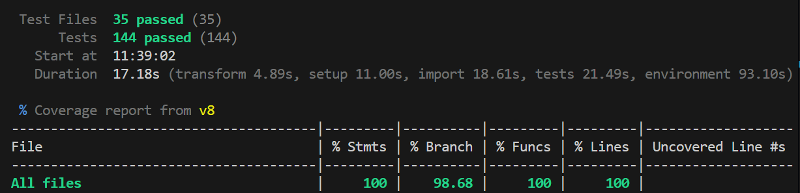

# 👟 Sneaker e-Commerce – High Performance & Testing Focus

Proyecto de e-commerce profesional desarrollado con **React** y **TypeScript**. Construido íntegramente desde cero (desde el diseño de interfaz enfocado en usabilidad hasta la arquitectura frontend) y evolucionado a un entorno robusto, completamente tipado y testeado para garantizar la máxima estabilidad y accesibilidad (WCAG).

 

    
     
     

 

---

## 🚀 [Ver Demo en Vivo →](https://sneaker-store-react.vercel.app)

 

    
     

 

---

## 🛠️ Stack Técnico

 

 

---

## 💎 Características Clave

- **TypeScript:** Tipado completo de modelos de datos, props y contextos globales para eliminar errores en tiempo de ejecución.
- **Checkout Multi-paso:** Flujo complejo de pago (Envío → Pago → Confirmación) con persistencia de estado y validaciones en tiempo real.
- **Accesibilidad (A11y):** Implementación de estándares WCAG, navegación por teclado y atributos ARIA.
- **Geolocalización:** Integración con Leaflet y OpenStreetMap para localización dinámica de tiendas.
- **Arquitectura de Estilos:** Metodología BEM para un CSS mantenible y escalable.

 

---

## 🧪 Calidad de Código (Testing)

Este proyecto prioriza la estabilidad. He implementado una suite de pruebas  con **Vitest** y **React Testing Library**.

- **Cobertura:** >98% en lógica de negocio y componentes críticos.
- **Pruebas de Integración:** Validación del flujo completo del carrito y checkout.
- **Unit Testing:** Pruebas unitarias para reducers, hooks personalizados y utilidades de formato.

    
     

---

## 🧠 Desafíos Técnicos y Aprendizajes

- **Migración a TS:** El mayor reto fue definir las interfaces para el estado global del proyecto. Aprendí a usar _Generics_ y a tipar correctamente la _Context API_, mejorando la DX (Developer Experience).
- **Gestión de Estado:** Sincronizar el stock en tiempo real entre diferentes vistas sin perder rendimiento.
- **Refactorización vía Testing:** Aprendí que el testing no es solo para buscar errores, sino que permite refactorizar código complejo con la seguridad de no romper funcionalidades existentes.

 

---

## ⚙️ Instalación y Uso

1. Clonar el repositorio: `git clone https://github.com/SaraCruzPerez/sneaker-store-react`
2. Instalar dependencias: `npm install`
3. Ejecutar proyecto: `npm run dev`
4. Ejecutar Tests: `npm run test`

---

Desarrollado por **Sara Cruz** - Especialista en Frontend & Accesibilidad.
