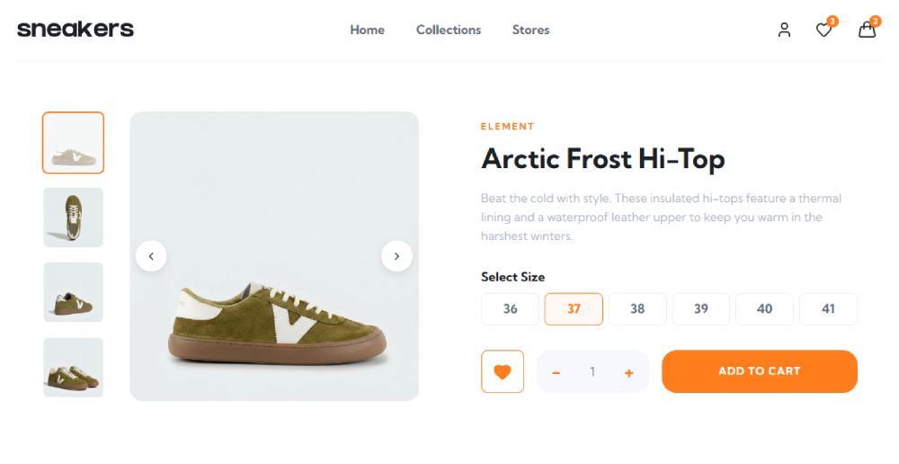
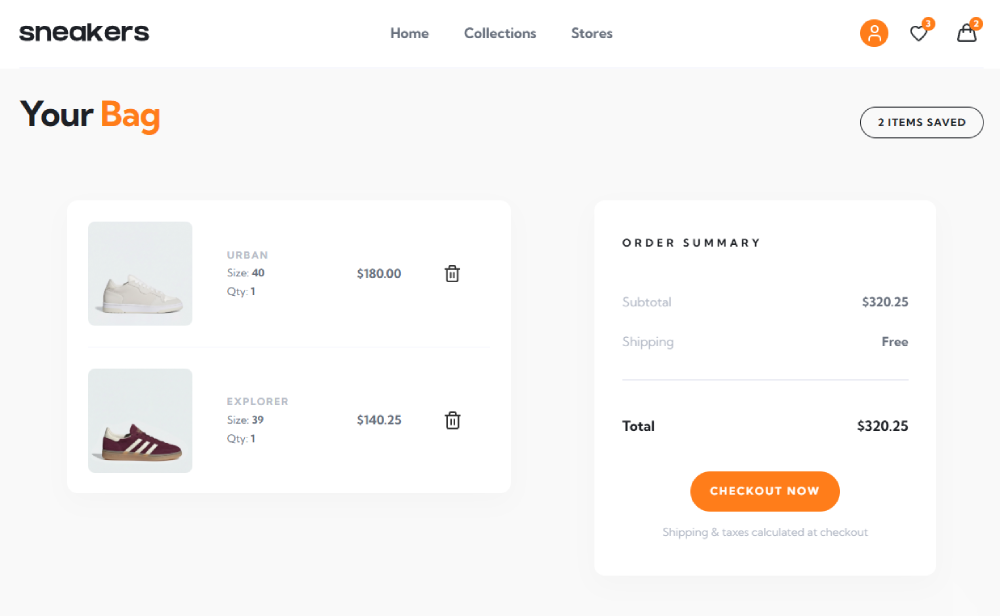
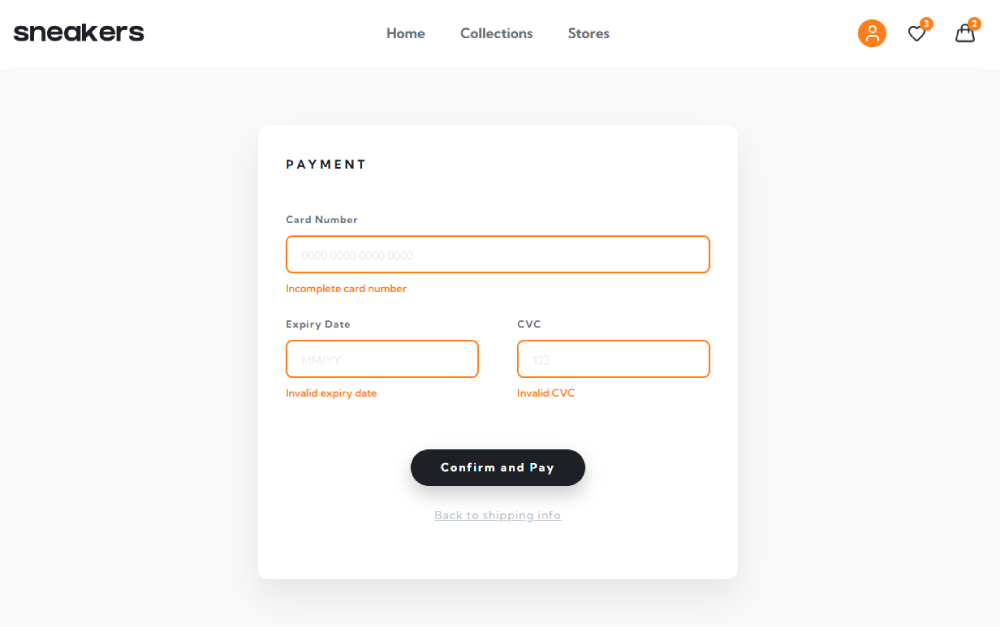

# Sneaker e-Commerce – Checkout & Experience

Este es un proyecto de e-commerce centrado en la experiencia de usuario durante el proceso de compra (Checkout), desarrollado con **React**. El objetivo principal fue crear un flujo de compra fluido y totalmente funcional, desde el carrito hasta la confirmación del pedido.

 

---

##  Vista Previa

 

    
     
     

  
  
  

 

---

##  Tecnologías utilizadas

* **React** (Hooks, Context API para la gestión del carrito)
* **React Router DOM** (Navegación entre pasos)
* **CSS3** (Arquitectura BEM, Grid, Flexbox y animaciones personalizadas)
* **JavaScript ES6+**

 

---

##  Características principales

* **Carrito de compras:** Gestión global del estado (añadir, eliminar y calcular totales en tiempo real).
* **Checkout por pasos (Multi-step Form):** Separación lógica de información de envío y método de pago para mejorar la conversión.
* **Validación de formularios:** Implementación de validaciones personalizadas con feedback visual inmediato para el usuario.
* **Diseño Responsive:** Layout adaptado para móvil y escritorio mediante CSS Grid y Media Queries.
* **Empty States & Success:** Gestión de estados vacíos del carrito y pantalla de confirmación con limpieza automática del estado.

 

---

##  Desafíos y Aprendizajes

Este proyecto representa mi primer gran reto como desarrolladora Frontend. Construirlo de forma autodidacta me permitió ser resolutiva y profundizar en la arquitectura de aplicaciones modernas:

* **Arquitectura de Componentes:** División de la interfaz en piezas reutilizables (Inputs, Cards, Steps), facilitando el mantenimiento y la escalabilidad del código.
* **Gestión de Estados Complejos:** Implementación de Context API para asegurar la coherencia de la información en toda la aplicación.
* **Resolución de Problemas:** Aprendí a investigar errores técnicos y persistir hasta encontrar la solución óptima, mejorando mi capacidad de debugging.
* **Lógica de Conexión:** Sincronización de flujos complejos (Carrito -> Checkout -> Success) manteniendo el estado global actualizado en cada paso.
* **Arquitectura CSS:** Uso estricto de la metodología BEM para mantener un código CSS limpio, escalable y profesional.
* **Validación de datos:** Implementé lógica de JavaScript puro para manejar formularios sin librerías externas, ganando control total sobre el flujo de datos.

 

---

Hecho por **Sara Cruz**

