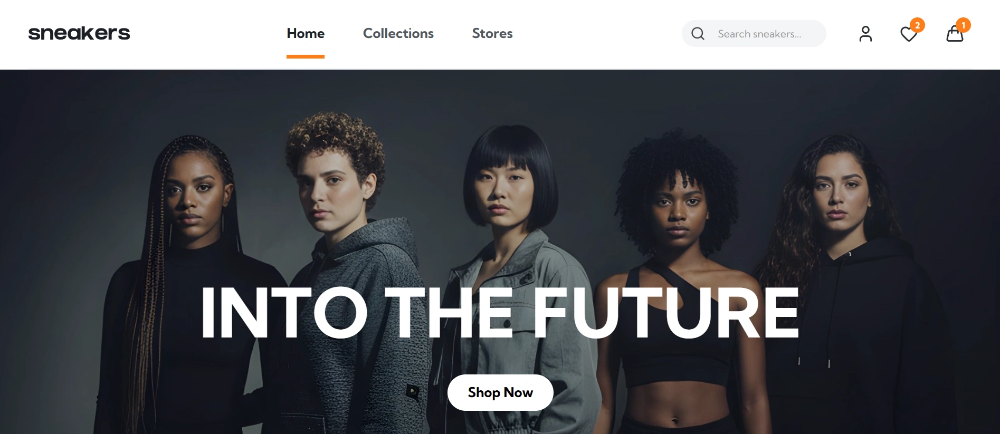
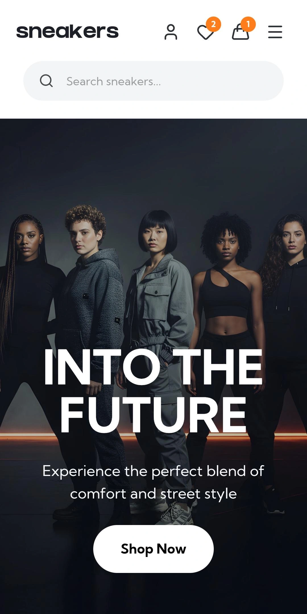
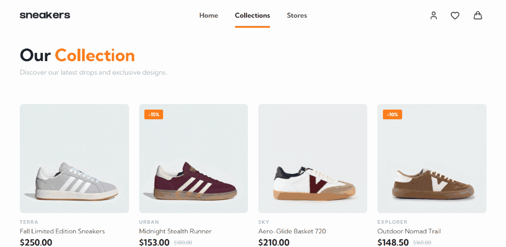
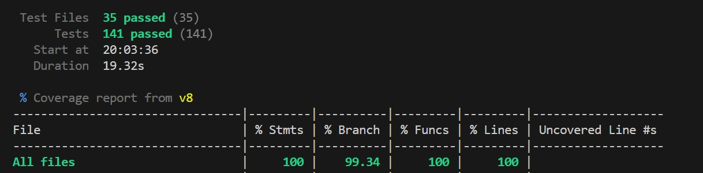

# 👟 Sneaker e-Commerce — React & TypeScript Frontend Application

Frontend e-commerce application built with React and TypeScript, focused on scalable frontend architecture, accessibility, responsive design, and testing.


<br />

<div align="center">    
     
     
</div>

<br />

---

## 🚀 Live Demo [View Live Project →](https://sneaker-store-react.vercel.app)

<br />

<div align="center">    
     
</div>


<br />


---

## 🛠️ Tech Stack

<br />


<br />

---

## 💎 Key Features

- **TypeScript Architecture:** Fully typed components, props, and global state management.
- **Advanced Checkout Flow:** Multi-step purchase flow with validation and state persistence.
- **Search Experience:** Real-time product search with instant filtering.
- **Accessibility (WCAG):** Semantic HTML, keyboard navigation, and ARIA support.
- **Geolocation Integration:** Dynamic store locator using Leaflet and OpenStreetMap.
- **Scalable Styling System:** Reusable UI structure using BEM methodology.
- **Testing:** Unit and integration testing with Vitest and React Testing Library.

<br />

---

## 🧪 Testing & Code Quality

Focused on maintainability and frontend stability through automated testing.

- 99%+ coverage across critical components and business logic.
- Integration testing for cart and checkout flows.
- Unit testing for reducers, utilities, and custom hooks.

<div align="center">    
     
</div>

---

## 🧠 Technical Challenges & Learnings

- Migrated the project from JavaScript to TypeScript to improve scalability and maintainability.
- Structured complex global state management and synchronized cart logic across views.
- Improved code reliability and refactoring confidence through testing strategies.

<br />

---

## ⚙️ Installation

```bash
# Clone repository
git clone https://github.com/SaraCruzPerez/sneaker-store-react

# Install dependencies
npm install

# Start development server
npm run dev
```

Run tests:

```bash
npm run test
```

---

Designed and developed by **Sara Cruz**
